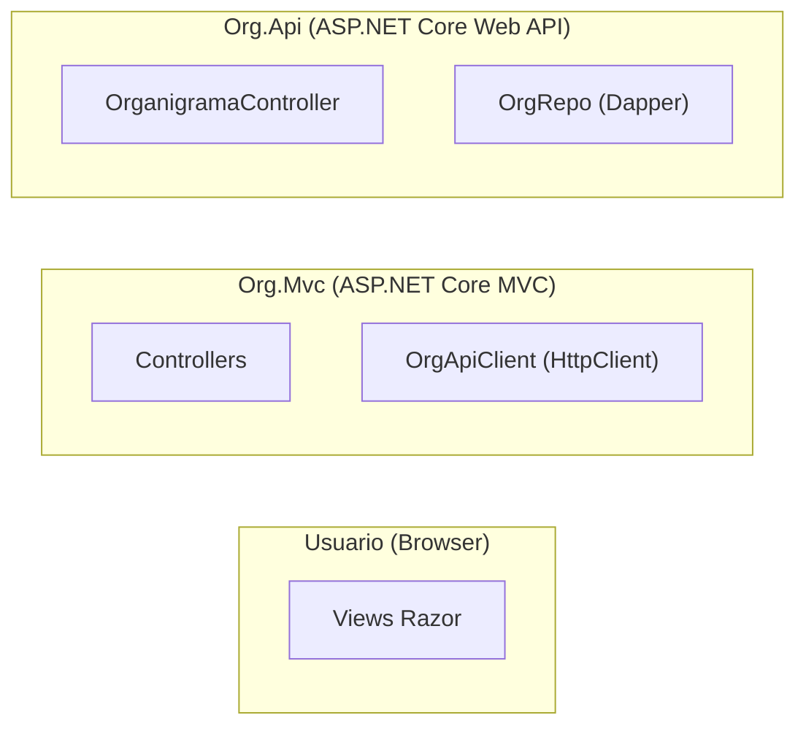
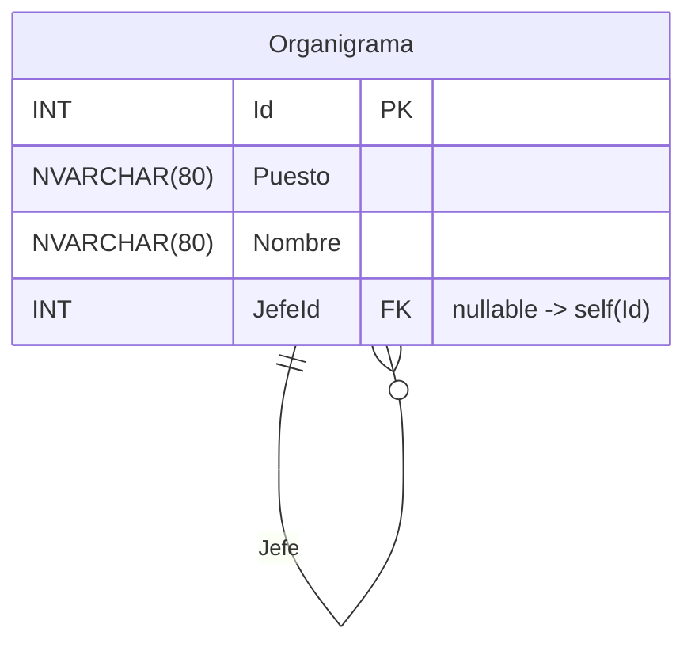
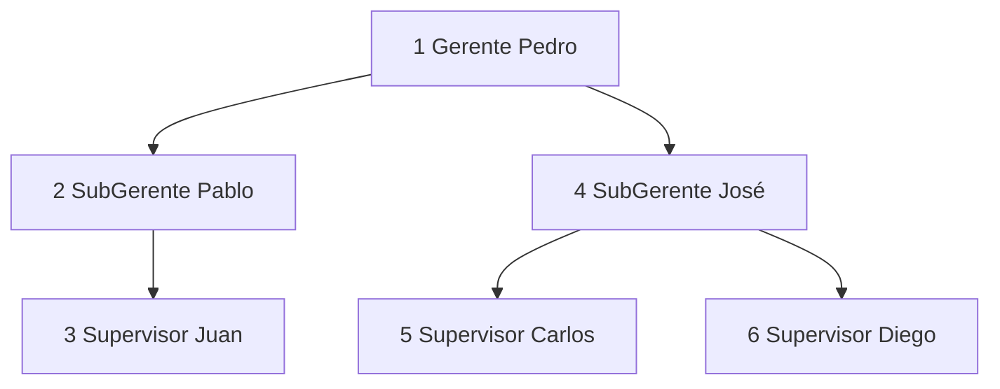
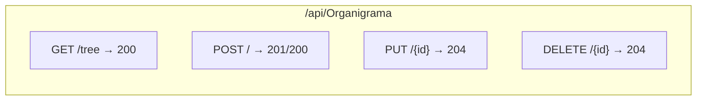
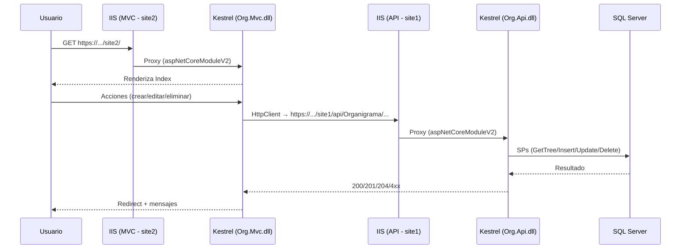
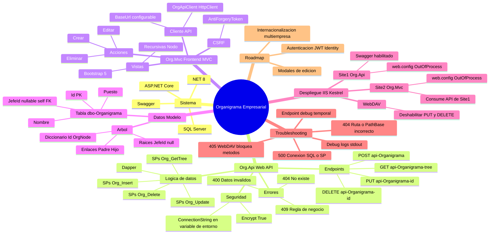

# 📂 Proyecto: Organigrama Empresarial (.NET 8 + SQL Server)

Este repositorio contiene dos aplicaciones complementarias desarrolladas en **ASP.NET Core 8** que en conjunto permiten **gestionar y visualizar un organigrama jerárquico de empleados** a partir de una tabla recursiva en SQL Server.

---

## ⚙️ Org.Api (Web API REST)

Proyecto **API RESTful** construido con ASP.NET Core:

- Endpoints bajo `/api/Organigrama` para operaciones CRUD:
  - **GET** `/tree` → devuelve la jerarquía completa en formato árbol.  
  - **POST** → inserta un nuevo nodo (empleado/puesto).  
  - **PUT {id}** → actualiza un nodo existente.  
  - **DELETE {id}** → elimina un nodo (validando dependencias).
- Usa **Stored Procedures** en SQL Server:
  - Org_GetTree
  - Org_Insert  
  - Org_Update
  - Org_Delete
- Manejo de errores con códigos semánticos (400, 404, 409) en lugar de 500.
- Incluye **Swagger/OpenAPI** para documentación y pruebas.
- Implementación con **Dapper** y conexiones SQL seguras (Encrypt=True).

---

## 🎨 Org.Mvc (Frontend MVC)

Proyecto **ASP.NET Core MVC** que consume la API:

- Interfaz web que renderiza el **árbol jerárquico de empleados** usando recursividad en vistas parciales.
- Formularios para **crear, editar y eliminar** empleados/puestos desde la UI.
- Manejo de feedback al usuario con **Bootstrap 5** (mensajes de éxito/error, validación de formularios).
- Servicios centralizados (`OrgApiClient`) para consumir la API REST.
- Separación de capas:
  - **Models** → entidades de UI  
  - **Controllers** → orquestan llamadas al API  
  - **Views** → despliegan el organigrama y formularios.

---

## 🛠️ Tecnologías utilizadas

- **.NET 8**  
- **ASP.NET Core MVC**  
- **ASP.NET Core Web API**  
- **SQL Server + Stored Procedures**  
- **Dapper**  
- **Bootstrap 5**  
- **Swagger / Swashbuckle**

---

## 📊 Diagramas

### 1) Arquitectura (MVC + API + SQL)

Endpoints

